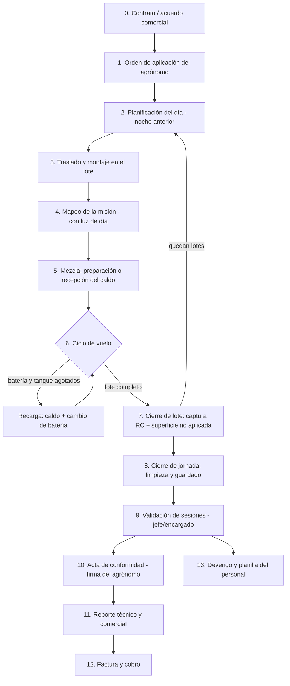

# Flujo base del negocio y sus excepciones

**Agrocom SRL · Documento oficial vigente · Derivado de las respuestas de campo del 25/8/2026**

Consolida el flujo operativo de punta a punta tal como lo relató el equipo en los cuestionarios (`docs/gestion/respuestas_campo/`), contrastado con `docs/negocio/ventana_al_negocio.md` y la especificación. El detalle por rol vive en `docs/negocio/politicas/`; la clasificación CONFIRMADO/CORREGIDO/DESCUBIERTO consolidada vive en `docs/gestion/respuestas_campo/analisis_clasificacion.md`.

Convención: cada etapa indica **quién** la protagoniza, **qué pasa hoy** según el campo, y **qué debe registrar el sistema**. Las excepciones (E-nn) están ancladas a su etapa.

---

## 1. El flujo base, de la orden al cobro

### Etapa 0 — Contrato / acuerdo comercial

**Dueño de Agrocom ↔ cliente.** Campaña residente (contrato grande) o aplicaciones de emergencia negociadas por el encargado ("esperar nuevas solicitudes para las aplicaciones de emergencia de otros clientes, negociar precio"). Se pacta: precio por hectárea, litros de caldo por hectárea (10 L/ha estándar; más litros = más precio), qué aporta cada parte (el cliente pone agua, productos y a veces la persona que prepara el caldo y la comida).

**Registra el sistema:** contrato, tarifas, aportes pactados, restricciones del cliente (horarios permitidos, velocidad máxima exigida).

### Etapa 1 — Orden de aplicación

**Agrónomo del cliente.** Decide con ~2 días de anticipación mirando clima; Agrocom verifica gasolina y repuestos antes de confirmar. Hoy la orden llega **verbal, por WhatsApp o papel** — croquis y mapas por WhatsApp incluidos. La dosis se expresa "por cada 100 litros" de caldo. Agrocom sugiere qué productos no mezclar, pero la receta es del cliente.

**Registra el sistema:** orden formal (producto, dosis, L/ha, lotes, restricciones) con evidencia del formato original si llegó por fuera.

### Etapa 2 — Planificación del día

**Jefe de campo, la noche anterior, EN COORDINACIÓN con el agrónomo del cliente** (hallazgo de campo: no es un acto interno). Asigna lotes y parejas piloto/auxiliar por **experiencia**: el piloto más experimentado va al lote con más obstáculos. Define turnos día/noche cuando aplica. Verifica pronóstico.

**Registra el sistema:** plan del día (lotes, parejas, orden), para comparar plan vs. ejecutado.

### Etapa 3 — Traslado y montaje

**Piloto + auxiliar.** Primer día: todo va guardado y revisado (llantas, chata, dron asegurado, mangueras, generador). Días siguientes: el control y su batería externa cargaron toda la noche. En el lote se elige la posición de operación y se baja dron, generador y baterías.

**Registra el sistema:** poco — a lo sumo checklist de salida. No frenar la operación con burocracia de traslado.

### Etapa 4 — Mapeo

**Piloto.** Planifica la misión sobre el lote en el RC; **se hace con luz de día** ("de noche no se puede ver"). Los obstáculos internos (casa, árbol, laguna) se marcan y el dron los rodea: **el obstáculo queda registrado en el mapeo** — esa es hoy la constancia de superficie no aplicada.

**Registra el sistema:** el mapeo es de DJI; el sistema captura su resultado al cierre (captura RC) y la declaración de sectores excluidos con motivo.

### Etapa 5 — Mezcla: preparación o recepción

**Dos escenarios reales** (hallazgo mayor del campo — la especificación §7 asume solo el segundo):

- **Escenario A (dominante hoy):** el cliente prepara el caldo con su personal; su encargado o el auxiliar lo cargan al dron. La responsabilidad del caldo es de quien lo preparó: "la responsabilidad cae en quien preparó la calda".
- **Escenario B:** Agrocom (auxiliar) prepara según la receta del agrónomo — aquí aplica el checklist secuencial de la especificación §7.

En ambos: Agrocom sugiere qué no mezclar; si el caldo sale mal preparado por el cliente, se rehace "con menos químicos" y el tanque perdido es del cliente.

**Registra el sistema:** quién preparó (cliente/Agrocom), receta u orden de referencia, problema de caldo detectado, y en escenario B el checklist con cantidades reales.

### Etapa 6 — Ciclo de vuelo (el ritmo que hace la plata)

**Piloto vuela; auxiliar sostiene la rotación.** Un vuelo dura **10–12 minutos** (batería y tanque se agotan casi juntos); ~5 tanques/hora. El auxiliar cambia la batería (**5 minutos**), recarga el caldo y pone a cargar la saliente — la **carga rápida del generador DJI tarda 8 minutos**, menos que el vuelo, así que con **3 baterías etiquetadas en rotación** el dron no espera. Durante el vuelo el piloto solo pilotea: mira cámaras por obstáculos y alertas del RC (baterías calientes, bombas tapadas). **"En pleno vuelo nada se debe hacer, solo pilotear"** — regla de oro de UX para la app del RC: capturar datos solo con el dron en tierra.

**Registra el sistema (app auxiliar / app RC):** recargas (litros, batería saliente y temperatura), combustible del generador, incidencias. En momentos de dron en tierra.

### Etapa 7 — Cierre de lote

**Piloto.** Al terminar cada lote saca **captura de pantalla del reporte del RC** (hectáreas totales, altura, tiempo, caudal) y pasa al siguiente lote (las hectáreas nunca vienen juntas: 100 ha llegan divididas en lotes de 5–20). Al terminar todos, avisa al cliente, manda las fotos de cada lote como reporte y —en trabajos spot— hace el cobro.

**Registra el sistema:** cierre de sesión/lote con hectáreas, captura RC, motivo de cierre, superficie no aplicada con motivo, hectárea acumulada de partida si hubo relevo.

### Etapa 8 — Cierre de jornada

**Piloto + auxiliar.** Mientras vuelan las últimas hectáreas, el auxiliar va guardando. Al final: **limpieza del dron por dentro y por fuera** ("para que el químico no fregue las mangueras o se endure... por fuera no se oxide"), lavado del tanque, baterías a cargar, guardado. El sobrante del último tanque se aplica en las **cortinas** (bordes del lote); los envases vacíos se dejan ordenados para el personal del cliente.

**Registra el sistema:** sobrante y destino, checklist de cierre de jornada (limpieza — hoy no modelada y es mantenimiento preventivo real).

### Etapa 9 — Validación

**Jefe de campo (o encargado), nunca el piloto de esa sesión.** Hoy la verificación real es contra el RC: capturas + inicio de sesión del control. "Los pilotos no pueden mentir porque todas las hectáreas quedan guardadas en el control remoto"; "ninguna discusión porque se sacan capturas". La validación dispara el devengo.

### Etapa 10 — Acta de conformidad

**Agrónomo del cliente firma.** Matiz de campo sobre la especificación: la firma puede ser **por lote ese mismo día o agrupada al terminar la aplicación completa**, "para que aprovechemos la ventana de aplicación". Formato de firma: indistinto (pantalla o papel fotografiado).

### Etapa 11 — Reporte

**Técnico** (por lote): hoy son las capturas del RC + PDF descargado de la nube DJI; se pide al superar ~500 ha o a demanda del cliente. Se quiere sumar fotos del trabajo e imagen del campo. **Comercial** (por aplicación): resumen Excel del encargado. El jefe pide el avance "mejor si es gráfico en un mapa".

### Etapa 12 — Factura y cobro

**Dueño, trato directo con el cliente.** El cliente "a veces paga de inmediato, otras veces 30 días". En trabajos spot cobra el piloto al cerrar.

### Etapa 13 — Devengo y planilla

**Sistema + dueño.** Piloto y auxiliar cobran por hectárea validada; anticipos los aprueba el dueño "mediante lo trabajado"; pagos por QR o efectivo con factura; rendiciones con captura del QR.

---

## 2. Las excepciones, ancladas a su etapa

| # | Etapa | Excepción real relatada | Manejo actual | Qué debe registrar el sistema |
|---|---|---|---|---|
| E-01 | 1 | Cliente promete 180 ha y da menos, lotes distantes, sin nadie que indique el lugar | Se fumigó lo que se pudo; un lote de 1 ha quedó sin fumigar | Diferencia contratado vs. ordenado vs. aplicado, por lote |
| E-02 | 2 | Amanece lloviendo | "Nada literalmente, hasta que pase la lluvia"; tras parar, esperar 30–60 min a que seque; lluvia todo el día = día perdido | Día no volable con causa; pausa por clima |
| E-03 | 5 | Al llegar al chaco recién traen el agua o los químicos, o la mezcla se cuajó | "Aquí se pueden perder horas" — hoy no queda registrado en ningún lado | **Pausa atribuible al cliente** con horas perdidas (la información que el encargado dice que "falta siempre") |
| E-04 | 5 | Cliente ordena cambiar de lote con el caldo ya preparado; se vuelve 3–4 días después y el caldo está "como lodo" | Se hizo "el reporte correspondiente con pruebas" de que fue orden del cliente | Orden de cambio de lote con autor; caldo perdido con causa atribuible |
| E-05 | 6 | Viento con ráfagas sobre ~20 km/h, o cliente que exige parar (o seguir) | Piloto para por seguridad del dron aunque el cliente quiera seguir; a veces el cliente impone (ej. "no más de 15 km/h de velocidad") | Condiciones + quién decidió + autorización firmada si se forzó |
| E-06 | 6 | Error de ESC/motor/batería en pleno vuelo | Retorno inmediato del dron, revisión física (cables, power board, temperatura); motor se cambia; batería caliente se retira | Incidencia tipificada con acción tomada |
| E-07 | 6 | Batería sobrecalentada — "el ciclo de daños": pines sucios → placa del dron → daña las demás baterías | Rotación etiquetada de 3 baterías + limpieza de pines; se retira la caliente | Temperatura por cambio de batería, batería y dron implicados |
| E-08 | 6 | Generador falla o no da abasto | Falla de sistema se resuelve (firmware, RC al cargador); falla mecánica = buscar taller / generador de respaldo | Incidencia de generador; combustible y horas de uso |
| E-09 | 6 | Caldo cortado, grumos, espuma — "el grumo es el enemigo silencioso": se detecta por caída de RPM de bombas/centrífugas | Limpieza de bombas y centrífugas; recuperación con coadyuvante; responsabilidad de quien preparó | Problema de caldo en la recarga + mezcla vinculada + RPM anómalo como señal |
| E-10 | 6/7 | Caída del dron (caso real: T50 de noche en maíz de 1,75 m) | 4 horas de búsqueda nocturna + un día más; se llevó otro dron para terminar el trabajo | Incidencia grave, sesión cerrada por falla, sesión nueva con otro dron, hectárea acumulada de partida |
| E-11 | 7 | Relevo / lote a medias | "Nunca se lo ha dejado": vuelve el mismo equipo u otro lo reemplaza; sin discusión de hectáreas "porque se sacan capturas" | Sesiones separadas por piloto con hectárea acumulada (ya modelado) |
| E-12 | 3–8 | Piloto o auxiliar se enferma o intoxica en campaña | El jefe lo suple hasta que llegue reemplazo; farmacia por caja chica | Reemplazo en sesión; gasto médico; (política de EPP pendiente — hoy "no te dan equipos de protección") |
| E-13 | 6 | Repuesto no está en base | Encargado cotiza (Agropix, Agrosolución, NP Agro), compra y envía por trufi/encomienda: mejor caso 4 h, típico 24 h, peor 48 h | Pedido de repuesto, dron en tierra, tiempos — alimenta stock crítico por base |
| E-14 | 12 | Gasolina escasa, comprada de reventa a 10–15 Bs/L sin factura | Rendición con fotos de los bidones | Gasto sin comprobante con evidencia fotográfica (ya modelado `tiene_comprobante`) |
| E-15 | 13 | Anticipo pedido por encima de lo devengado | Lo decide el dueño caso por caso | Tope 3.000 Bs/mes y 70% del devengado (ya modelado) + registro de la decisión |

---

## 3. Ventanas horarias reales (regla nueva de campo)

- **Mañana 6:00–10:00 y tarde 16:00–20:00** como norma: con sol fuerte (10:00–16:00) "la gota se pulveriza y no cae al campo"; de noche el **sereno** hace resbalar la gota.
- **No es absoluto**: día nublado habilita el mediodía; noches sin sereno habilitan vuelo nocturno (los turnos día/noche existen).
- **El cliente modula la ventana**: hay clientes que permiten fumigar todo el día y clientes que exigen parar por viento, sol o sereno.

Consecuencia para el sistema: las ventanas y los límites de condiciones son **parámetros por contrato/orden**, no constantes globales (viento ≤17 km/h y temperatura ≤30 °C de la especificación vs. <40 °C que declaró el campo — conflicto a cerrar en reunión, ver `analisis_clasificacion.md`).
